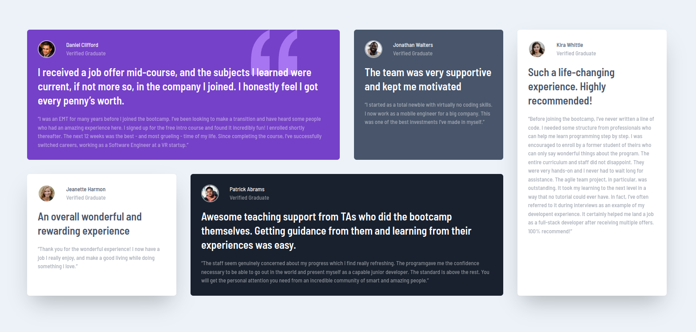

# Frontend Mentor - Testimonials grid section solution

This is a solution to the [Testimonials grid section challenge on Frontend Mentor](https://www.frontendmentor.io/challenges/testimonials-grid-section-Nnw6J7Un7). 

## Table of contents

- [The challenge](#the-challenge)
- [Screenshot](#screenshot)
- [Links](#links)
- [Built with](#built-with)
- [Author](#author)

## The challenge

Users should be able to:

- View the optimal layout for the site depending on their device's screen size

## Screenshot

## Links

- Solution URL: [GitHub project page](https://github.com/kondzerau-ivan/testimonials-grid-section)
- Live Site URL: [Go to Live](https://kondzerau-ivan.github.io/testimonials-grid-section/)

## Built with

- TailwindCSS
- Vitejs
- GitHub Pages

## Author

- Website - [GitHub](https://github.com/kondzerau-ivan)
- Frontend Mentor - [@kondzerau-ivan](https://www.frontendmentor.io/profile/kondzerau-ivan)
- LinkedIn - [Ivan Kondzerau](https://www.linkedin.com/in/ivan-kondzerau/)
